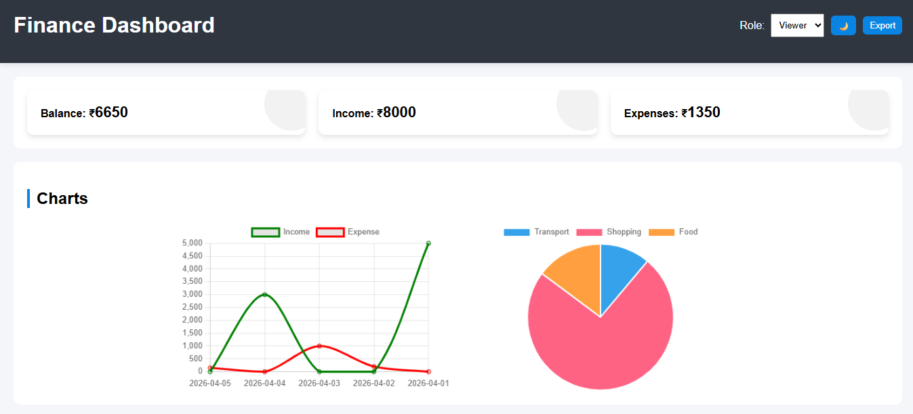
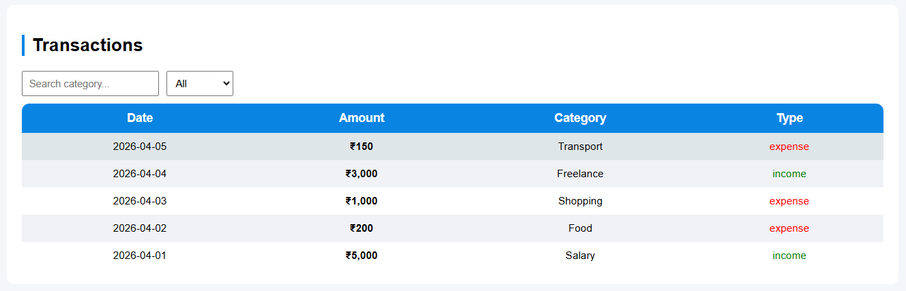

# 💰 Finance Dashboard UI

## 📌 Overview
This is a simple and interactive Finance Dashboard built as part of a Frontend Developer Intern assignment.

The dashboard allows users to track financial activity, view insights, and analyze spending patterns.

---

## 🚀 Features

### 📊 Dashboard Overview
- Total Balance, Income, and Expenses
- Clean summary cards

### 📈 Charts
- Line chart showing transaction trends
- Pie chart showing category-wise spending

### 📋 Transactions
- View all transactions
- Search by category
- Filter by Income/Expense

### 👤 Role-Based UI
- Viewer: Can only view data
- Admin: Can access additional controls (UI simulation)

### 💡 Insights
- Highest spending category
- Income vs Expense comparison

---

## 🛠️ Technologies Used
- HTML
- CSS
- JavaScript
- Chart.js

---

## ▶️ How to Run
1. Download or clone the project
2. Open `index.html` in any browser

---

## ✨ Additional Improvements
- Responsive design for mobile screens
- Clean UI with proper spacing and layout
- Basic state management using JavaScript
- LocalStorage support (optional enhancement)

---
## 🚀 Advanced Features (Added for Enhancement)

- 🌙 Dark Mode with persistence
- 📄 Export transactions as CSV
- 💾 LocalStorage data persistence
- 🎯 Improved UI interactions and animations
- 📱 Responsive design for all screen sizes

## 📌 Notes
This project focuses on frontend design, user experience, and basic data handling using mock data.

No backend or database is used.
## 📸 Screenshots

### Dashboard

### Transactions

### Charts

